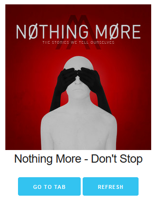

  

# webtask-tabify
A small (&lt;100 line) webtask that can be used to automatically pull up the best-matching guitar tablature for your currently-playing song in Spotify.

# Requirements
* `express`
* `webtask-tools`
* `request`
* `ultimate-guitar-scraper`

# Configuration

*_Note_*: This was written using the online Webtask Editor ([webtask.io/make](https://webtask.io/make)) instead of by CLI, so all instructions below are written with that in mind.

1. Copy this script as the basis for your own webtask.
2. This webtask uses three values stored as secrets (`clientId`, `clientSecret`, & `redirectUri`) that you will have to configure your own values for.

    2a. `clientId` & `clientSecret` can be obtained by setting up your own app via the [Spotify Developer portal](https://developer.spotify.com/). (*_Tip_*: The redirect URI as configured in the Spotify Developer portal for your app needs to be the generated endpoint for your webtask.) The `clientId` will be your Spotify app's `Client ID`; the `clientSecret` will be your Spotify app's `Client Secret`.
    
    2b. `redirectUri` will also be the generated endpoint for your webtask (same as the redirect URI you have specified in your Spotify app.)
3. Load up a song in Spotify, call the webtask, provide permission to your app, and have fun playing along to your favorite tracks!

# TODO

* Verify tab name / content to prevent serving incorrect tabs for bands / songs with more common words in their names.
* Store access_token / refresh_token instead of demanding new authentication each time refreshes.
* Better handling of multi-artist songs.
* Provide control over filter by Tabs, Chords, or both when scraping UG.
